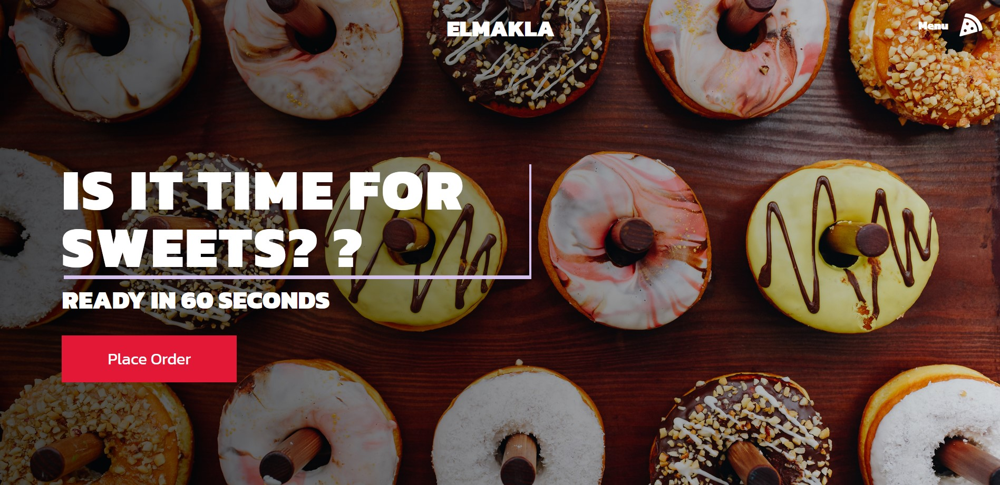

## Description

A responsive react app built with styled-components .
Live demo on https://restaurant-website-zeta.vercel.app/

## Technologies & Tools

* React
* Styled-components


## Installation and Usage


### Steps:
1. Clone repo on your local machine:
```
git clone git@github.com:Da3az/restaurant-website.git
```
2. Install dependencies:
```
$ npm install
```
3. Execute the app:<br/>
```
$ npm run start
```
8. App now should be running on ```localhost:8000```
